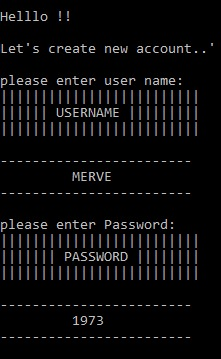

 # Diary-System
 # Why This Project Was Made
 
Storing diary information on your computer can be unintuitive for several reasons including the hassle to create new files, trying to find which diary was which, etc.

This is why the diary management system comes in. It solves a lot of problems about storing your diaries. You no longer have to worry about protection or scrolling through a lot of files to find the diary number you want to access.

The diary management system is the perfect tool for people that don’t want to use the usual Windows UI, and want something more complex for storing their diaries.
# Project Features
* Password protected enviroment: Provides security for your belowed diaries
* Creating diaries in a number-sorted way: All of your diaries are stored with a diary-number
* Accessing your existing diaries using the diary-number: You no longer need to scroll through a bunch of files to find the diary you want to Access
* Editing your existing diaries with an intuitive system : You can choose which information you want to edit in your diary, and the new version will replace the old immidiately
* Edit password: You can change your password any time if you do not want to use your old password anymore and in the same time you can change your username

# Welcome Page

You are greeted with this message when you opend the program.

It asks you whether you have account or not .

If you do not have account you should enter “Y” if not “N”.
# Create An Account
 
when you enter “N” you will be greeted with this page.

. First thing you need to do is that enter a username and password.

. But be careful to not forget your password or username

because if you forget your username or your password you can’t open your diary system again.

There is no condition for creating username and password .

You can all characters in the ASCII standard.

After creating password and username if you see this message this means you opened new diary system. 
Not: This is my first coding project, indentation is sucks

